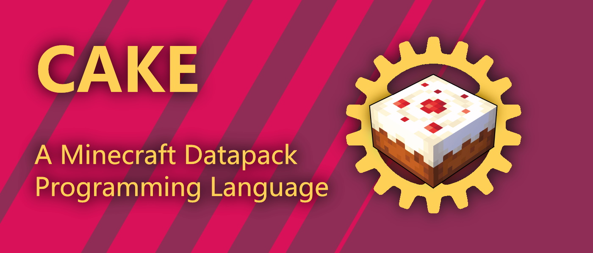

<br />

# CakeLang

CakeLang is an open source cross-platform Minecraft data pack programming
language, that compiles to Minecraft functions.

- [Source Code](https://github.com/WilliamRagstad/CakeLang) - view the source
  code on GitHub. <br />
- [Wiki](https://github.com/WilliamRagstad/CakeLang/wiki) - learn more about the
  language and how to use it. <br />

<!--[discord](https://discord.gg/Jd4UCueKA8) - share ideas, show off work, and report bugs! <br />-->

# About

Cake is an open source programming lanaguge designed for everyone who mods
vanilla Minecraft. Its core mechanic is compiling down to a behavior pack based
on a context-aware compiler. It has always full support for the latest Minecraft
features, and have a powerful static analyzer and tooling, such as syntax
highlighting plugins for modern text editors and descriptive and helpful compile
time error messages.

Use Cake to build better data packs!<br /> CakeLang tries to push forward the
boundaries and strengthen the command engineering community to make even more
awesome things possible!

# Examples

The code below is a simple example of how to print hello world to the chat for three random players.

`Greet three players`
```py
import player from minecraft

macro randomClose(maxRadius) {
    # Or use minecraft:player
    r(type=player, radius<=maxRadius)
}

repeat(3, {
    say(randomClose(10), "Hello {@s}!");
});
```

# Features


# Modules
Good code is modular.
Create and share modules with other developers to reuse common code or advanced concepts and features.

Using shared modules is a great way to quickly build high quality data packs. With Cake comes a rich set of builtin modules that can be used in your own projects. Those modules are:

* `minecraft` - provides access to the Minecraft API.
* `raycast` - provides a simple raycasting API.
* `random` - provides a random number generator.
* `math` - provides math functions.
* `time` - provides time functions.
* `string` - provides string functions.
* `entity` - provides entity functions.
* `block` - provides block functions.
* `item` - provides item functions.
* `player` - provides player functions.
* `world` - provides world functions.
* `server` - provides server functions.
* `command` - provides command functions.
* `event` - provides event functions.
* `config` - provides config functions.
* `permission` - provides permission functions.
* `chat` - provides chat functions.
* `json` - provides json functions.

## Third-party Modules
Cake also have support for using third-party modules imported from different sources. There is no official package manager for Cake at the moment, but you can use any package manager you like by saving the module to a folder in the `modules` folder in your project and importing it in your code using the `import` keyword.

It is encouraged to use third-party modules that are well tested and maintained. Preferrably hosted on GitHub. There might be support in the future for importing modules from a remote server using a resouce URI similar to Deno.